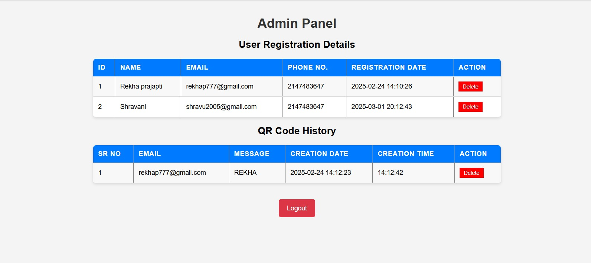
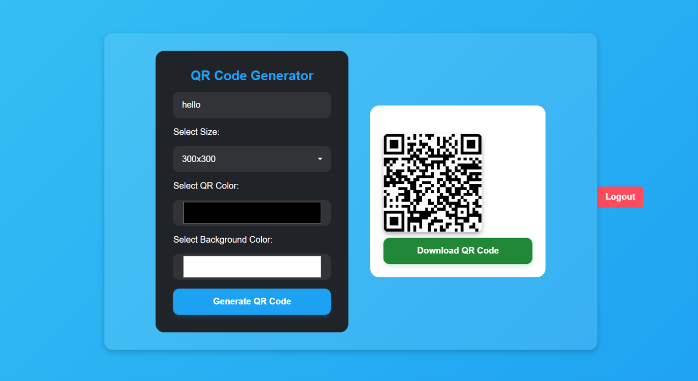

# 🧾 QR Code Generator

A simple web-based QR Code Generator built using **PHP**, **HTML**, **CSS**, and **JavaScript**.  
Users can generate QR codes based on text, URLs, or messages, and choose size and color.  
Admin can view QR generation history.

---

## 🚀 Features

- 🧑‍💻 User login & registration
- 🧠 Generate QR codes for text, URL, or messages
- 🎨 Select color and size
- 📜 Admin panel to view generation history
- 💾 Data stored in MySQL database

---

## 🛠️ Tech Stack

| Component | Technology |
|------------|-------------|
| Frontend | HTML, CSS, JavaScript |
| Backend | PHP |
| Database | MySQL |
| QR Api | `Api_Qr_server` |

---

## 📸 Screenshots

⚙️ Setup Instructions
Clone this repo:

bash
Copy code
git clone https://github.com/YourUsername/QR-Code-Generator.git
Move files to your XAMPP htdocs folder.

Import the database (qrsql) into phpMyAdmin.

Start Apache & MySQL.

Open http://localhost/QR-Code-Generator in your browser.

👨‍💻 Developer
Prajwal Shekhar Maka
📧 Prajwalmaka777@gmail.com 
💼 https://www.linkedin.com/in/prajwal-maka-416a19300/
